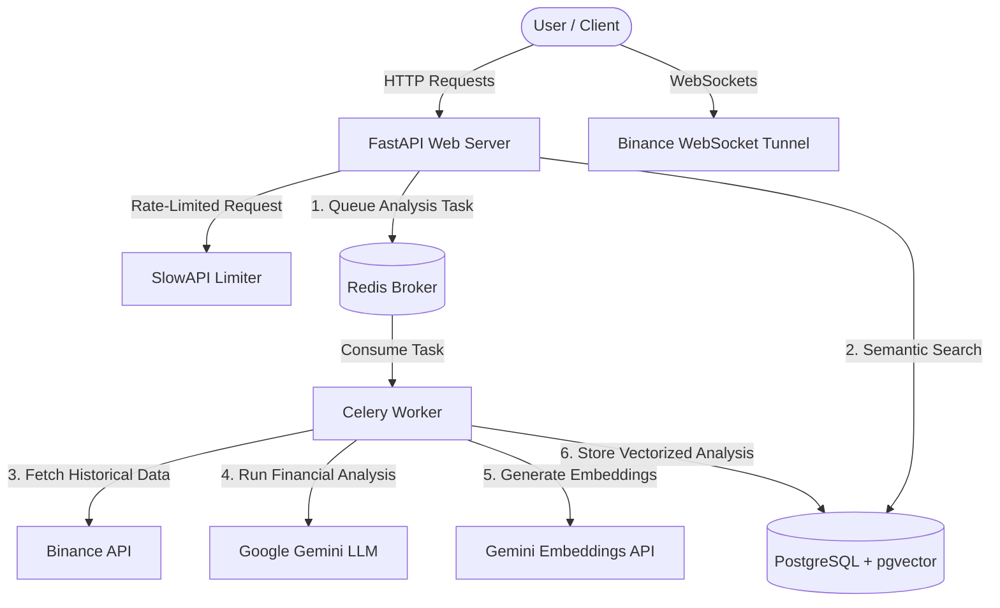

# Multi-Source AI Trading & Financial Analysis API

A production-grade, asynchronous FastAPI backend that implements a modular architecture to ingest market data from the Binance API, run automated technical indicators (Simple Moving Averages), perform AI-driven sentiment analysis using Google Gemini, store high-dimensional embeddings in PostgreSQL using `pgvector`, and expose the data via semantic vector search.

This project is fully dockerized and utilizes Redis and Celery to process computationally heavy trade analysis tasks asynchronously in the background.

---

## 🏗️ Architecture Overview

The system is designed with a separation of concerns, separating the lightweight, high-performance web layer from the resource-intensive AI and analysis worker processes.



---

## 🛠️ Tech Stack & Concepts Demonstrated

*   **FastAPI**: Async-first web framework leveraging Pydantic v2 and Python 3.12 features.
*   **PostgreSQL & pgvector**: Relational database storage with vector extensions to support Cosine Distance similarity search on AI-generated trade sentiments.
*   **Celery & Redis**: Event-driven background task processing to execute long-running market analysis and AI tasks out-of-band without blocking FastAPI's event loop.
*   **Google Gemini (GenAI SDK)**: Leveraging `gemini-2.5-flash` for structured sentiment generation and `gemini-embedding-001` for vector embedding generation.
*   **Binance API**: Dynamic fetching of ticker data, order book, and daily klines (candlesticks).
*   **Alembic**: Database schema migrations for PostgreSQL.
*   **Docker & Docker Compose**: Orchestrates multi-container services (Web, DB, Redis, Celery Worker).
*   **SlowAPI**: Rate limiting for DDoS and abuse protection on sensitive endpoints (e.g. trade execution).

---

## 📂 Project Structure

We follow the industry-standard **`/app` src layout** separating the application components logically:

```
├── alembic/                  # Database schema migrations
├── app/                      # Main application package
│   ├── api/
│   │   └── routes/           # Router groups (auth, trading)
│   ├── core/                 # Configuration, security utilities, and rate-limiting
│   ├── db/                   # Database session, models, and schemas
│   ├── services/             # Background services (Celery worker, AI utilities)
│   └── main.py               # Application entrypoint
├── Dockerfile                # Multi-stage python image definition
├── docker-compose.yml        # Orchestration file for all services
├── init_db.py                # Database initialization script
├── requirements.txt          # Python dependencies
└── test_main.py              # Asynchronous unit test suite
```

---

## 🚦 Getting Started

### Prerequisites
*   Docker & Docker Compose
*   A Google Gemini API Key
*   Binance Testnet Keys (Optional, for live trade calls)

### 1. Configure the Environment
Create a `.env` file in the root directory:
```env
POSTGRES_USER=postgres
POSTGRES_PASSWORD=postgres
POSTGRES_DB=trading_db
DATABASE_URL=postgresql+asyncpg://postgres:postgres@db:5432/trading_db

REDIS_URL=redis://redis:6379/0
SECRET_KEY=your-jwt-super-secret-key

GEMINI_API_KEY=your-gemini-api-key
BINANCE_TESTNET_API_KEY=your-binance-key
BINANCE_TESTNET_SECRET_KEY=your-binance-secret
```

### 2. Launching with Docker Compose
To build and spin up the entire application stack:
```bash
docker compose up --build
```
This starts:
1.  **FastAPI** at `http://localhost:8000` (API documentation accessible at `/docs`)
2.  **PostgreSQL** database initialized with `pgvector`
3.  **Redis** server acting as a Celery broker
4.  **Celery Worker** running trade execution background jobs

### 3. Initialize the Database Tables
To create database tables, run the initialization script inside the container or locally:
```bash
docker compose exec web python init_db.py
```

---

## 🧪 Testing

The test suite validates authentication, rate limiting, and core endpoint structures asynchronously using `pytest` and `httpx`.

To run the unit tests:
```bash
docker compose exec web pytest -v
```

---

## 🔗 Code Architecture Walkthrough

- **Entrypoint**: [app/main.py](file:///C:/Users/imota/Desktop/Backend%20Engineering/FastAPI/Project/app/main.py) registers routers, rate limiters, and logs using custom production-grade JSON logging formatters.
- **Asynchronous Routes**: [app/api/routes/trading.py](file:///C:/Users/imota/Desktop/Backend%20Engineering/FastAPI/Project/app/api/routes/trading.py) uses async Httpx-like connections to Binance to fetch prices instantly without thread blocking.
- **Asynchronous Worker Strategy**: [app/services/worker.py](file:///C:/Users/imota/Desktop/Backend%20Engineering/FastAPI/Project/app/services/worker.py) houses the Celery tasks, allowing intensive calculations like SMA computations and Gemini LLM text generation to execute on a separate worker node.
- **pgvector Integration**: Semantic search in [app/api/routes/trading.py](file:///C:/Users/imota/Desktop/Backend%20Engineering/FastAPI/Project/app/api/routes/trading.py#L88) performs vector database search on embeddings using:
  ```python
  select(models.TradeAnalysis).order_by(models.TradeAnalysis.embedding.cosine_distance(query_vector)).limit(1)
  ```
